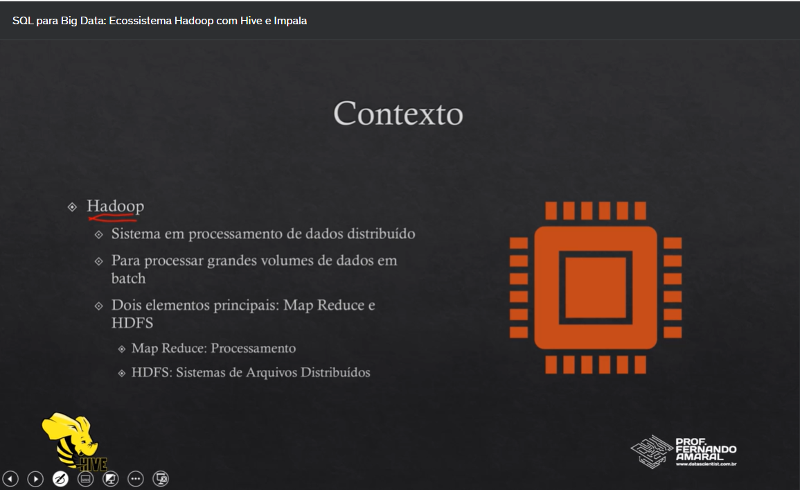
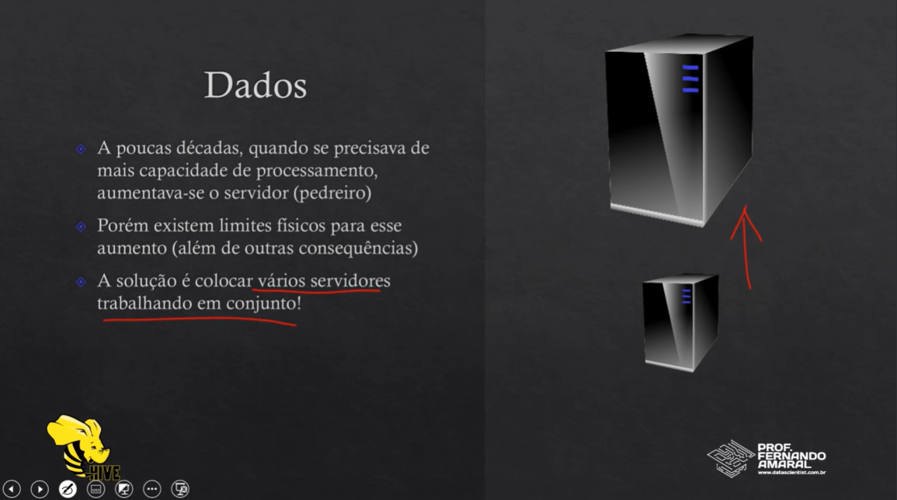
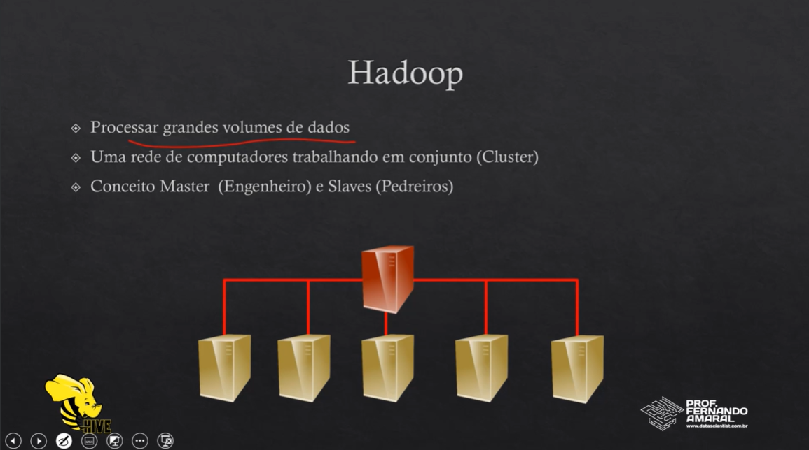
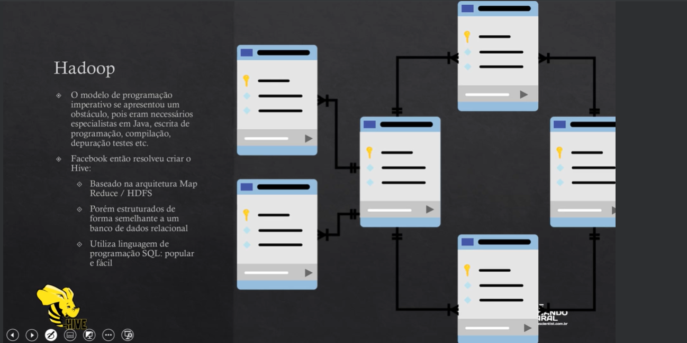

Hadoop
    Sistema em processamento de dados distribuido.
    Para processar grandes volumes de dados em batch.
    Hadoop tem dois elementos principais: Map Reduce e HDFS.

Map Reduce: Processamento.
HDFS: Sistemas de Arquivos Distribuidos.

